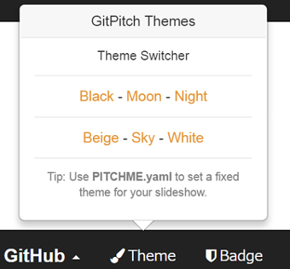

### GitHubだけで作成するスライド
設定編
　  

　  
　  
　  
　　　　垣花　暁
---
このスライドの作成に、  
「GitPitch」というサービスを使っています。
---
最初にこんなの作りました。  
https://gitpitch.com/kakisoft/HowToUseGitPitch/master
---
今回は、各種設定の話です。
---
PITCHME.yaml  
というファイルを作成し、設定を記述します。

---
まずはテーマ。
---
ここのテーマは  
　  
### theme :night

と指定しています。  
　  
他には ・・
---?image=assets/ThemeMOON.png
---?image=assets/ThemeBEIGE.png
---?image=assets/ThemeBLACK.png
---?image=assets/ThemeSKY.png
---
等のテーマがあります。
---
左下のメニューより、  
一時的にテーマを変更する事も出来ます。
  

※テーマ未設定時のみ有効
---
背景。
---?image=assets/bg.png
### background : assets/bg.png
等で、背景画像が設定できます。
---?image=assets/bg.png
テーマとの併用は難しそうなので、  
どちらかを選べばいいと思います。
---
画面遷移時のアクション
---
### transition : fade
等で、遷移時のアクションを設定できます。  
convex, concave, default,  
fade, none, slide, zoom  
が設定できるようです。
---
ロゴ。
---
### logo : assets/logo.png
等で、ロゴを表示できます。  
（左の画像です）
---
余談ですが、  
このスライドはスマホで見ても  
結構綺麗に表示してくれます。
---
ただ、ロゴの大きさはどちらで見ても変わらないので、
小さめに設定しておかないと、スマホで見た時、文字がロゴの下に隠れてしまう事があります。
---
スライド番号
---
### slide-number: true
で、番号をつける事ができます。  
（右下の番号です）
---
フットノート
---
### footnote : "© 2017 kakisoft"
等で、フットノートが設定できます。  
（下の内容です）
---
時間経過で、  
自動的に次のスライドに進める事も出来ます。
---
### autoslide : 5000  
と設定することで、  
5秒おきにスライドが自動で流れます。
---
```　  
<!-- .slide: data-autoslide="5000" -->
```　  
　  
と記述すれば、スライド単位での  
遷移時間が設定可能です。  
（これは PITCHME.md に記述します。）
---
「５分きっかりで終わらせたい」  
といった時に有効ですね。
---
他にも色々あるので
---
詳細は、公式サイトを参照して下さい。
https://github.com/gitpitch/gitpitch/wiki/Slideshow-Settings
---
このスライドの PITCHME.md は、     
[こんな感じ](https://github.com/kakisoft/HowToUseGitPitch2/blob/master/PITCHME.md.txt)です。
---
おわり
