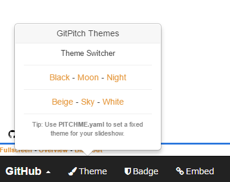

### GitHubだけで作成するスライド
設定編
　  

　  
　  
　　　　垣花　暁
---
このスライドの作成に、  
「GitPitch」というサービスを使っています。
---
最初にこんなの作りました。  
https://gitpitch.com/kakisoft/HowToUseGitPitch/master
---
今回は、各種設定の話です。
---
PITCHME.yaml  
というファイルを作成し、設定を記述します。

---
まずはテーマ。
---
ここのテーマは  
　  
### theme :night

と指定しています。  
　  
他には ・・・
---

---

---

---

---
等のテーマがあります。
---
左下のメニューより、  
一時的にテーマを変更する事も出来ます。  
  
※テーマ未設定時のみ有効
---
次に、背景。
---

---
テーマとの併用は難しそうなので、  
どちらかを選べばいいと思います。
---
次に、画面遷移時のアクション
---
### transition : fade
等で、遷移時のアクションを設定できます。  
convex, concave, default, 
fade, none, slide, zoom
が設定できるようです。
---
次に、ロゴ。
---
### logo : assets/logo.png
等で、ロゴを表示できます。  
（左の画像です）
---
次に、スライド番号
---
### slide-number: true
で、番号をつける事ができます。  
（右下の番号です）
---
次に、フットノート
---
### footnote : "© 2017 kakisoft"
等で、フットノートが設定できます。  
（左下の内容です）
---
次に、コードハイライト
---

```
ここは
highlight : monokai
と設定した場合です。
```
a
```
ここは
highlight : mono-blue
と設定した場合です。
```
---

詳細は、公式サイトを参照して下さい。
https://github.com/gitpitch/gitpitch/wiki/Slideshow-Settings

